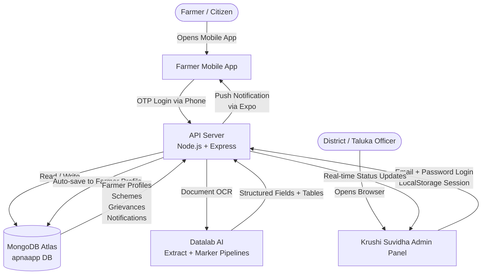
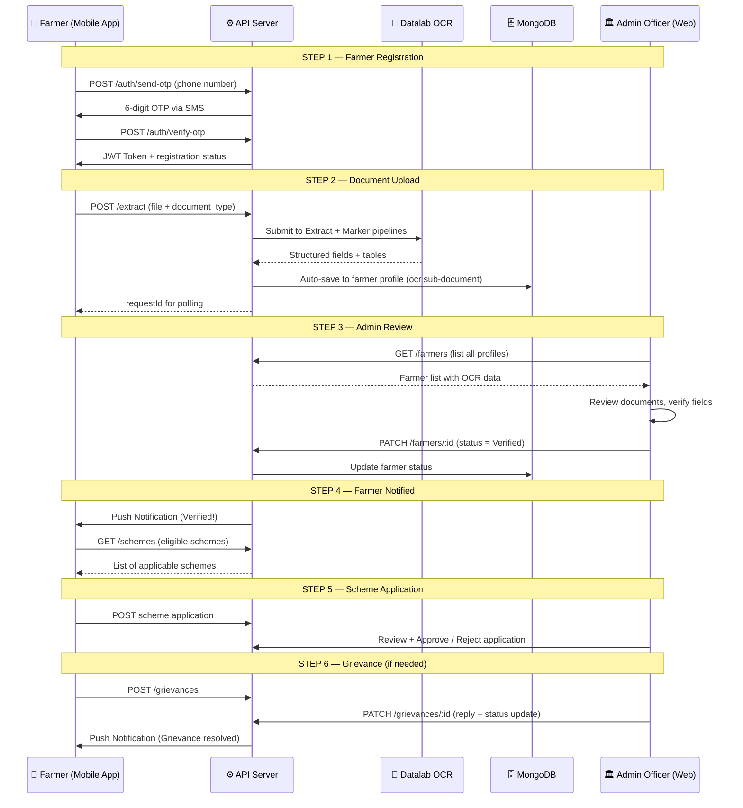
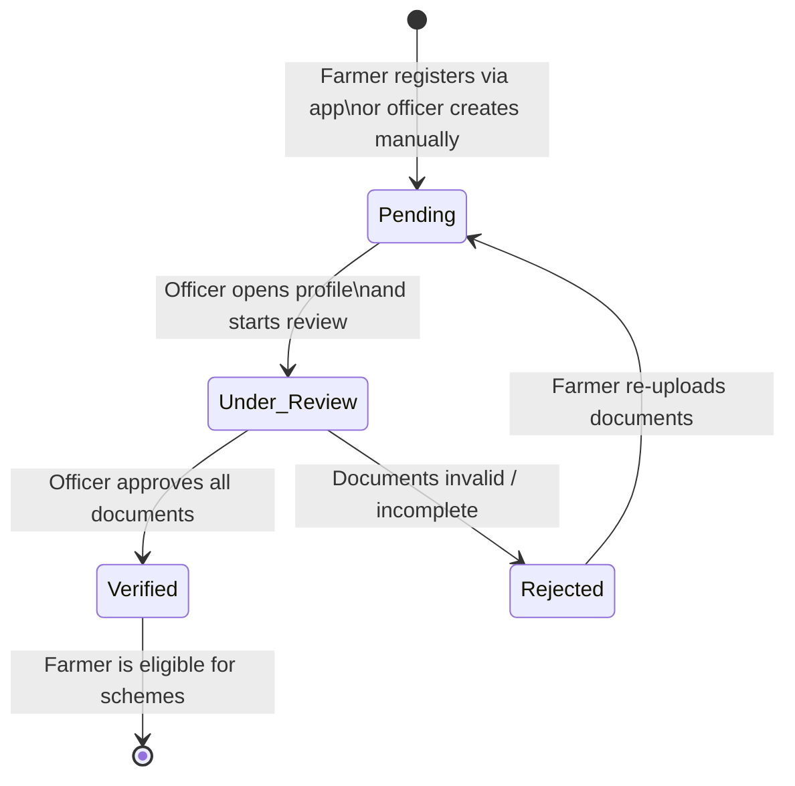

# Krushi Suvidha AI — Basic System Flow

## Overview

Krushi Suvidha AI is a two-sided platform:
- **Mobile App** — Used by farmers to register, upload documents, apply for schemes, and file grievances.
- **Admin Panel** — Used by government district/taluka officers to verify farmer registrations, review documents, approve scheme applications, and resolve grievances.

Both sides communicate through a shared **REST API** backed by **MongoDB Atlas**.

---

## High-Level System Flow

---

## Step-by-Step Basic Flow

---

## Status Lifecycle — Farmer Profile

---

## Document Types Supported

| Document | Purpose |
|---|---|
| **Aadhaar Card** | Identity verification — name, DOB, address, UID |
| **Bank Passbook** | Financial — bank name, IFSC, account number, DBT linkage |
| **Form 7 (Satbara)** | Land ownership — survey number, area, owner name |
| **Form 12 (Hakkpatra)** | Land rights and mutation history |
| **Form 8A (Khate Utara)** | Crop inspection, irrigation, farming type |

---

## Key Actors

| Actor | Platform | Access Level |
|---|---|---|
| **Farmer** | Mobile App (Expo/React Native) | Own profile, own documents, own schemes, own grievances |
| **Taluka Officer** | Admin Web Panel | Dashboard, Registration, Farmer Registry, Grievances |
| **District Officer** | Admin Web Panel | All above + Scheme Applications, Subsidies, Insurance, Reports |
| **Admin (DAO)** | Admin Web Panel | Full access including User Management, Settings |
| **Viewer** | Admin Web Panel | Dashboard + Reports (read-only) |
