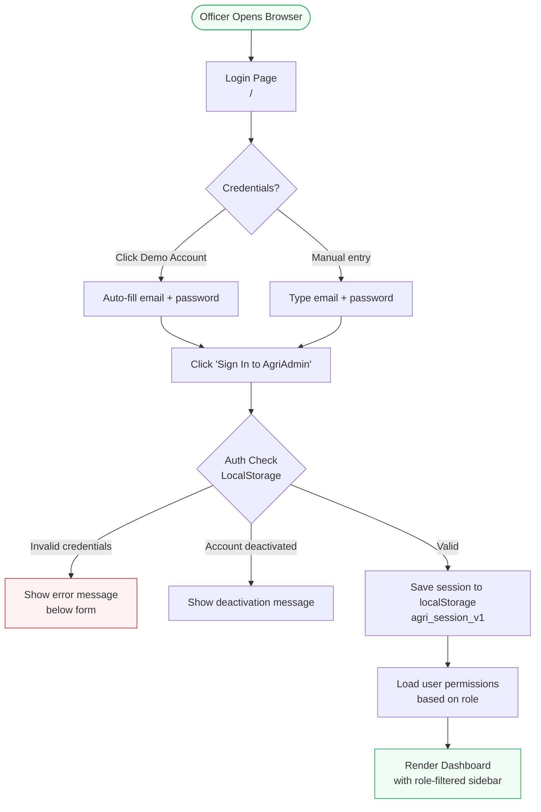
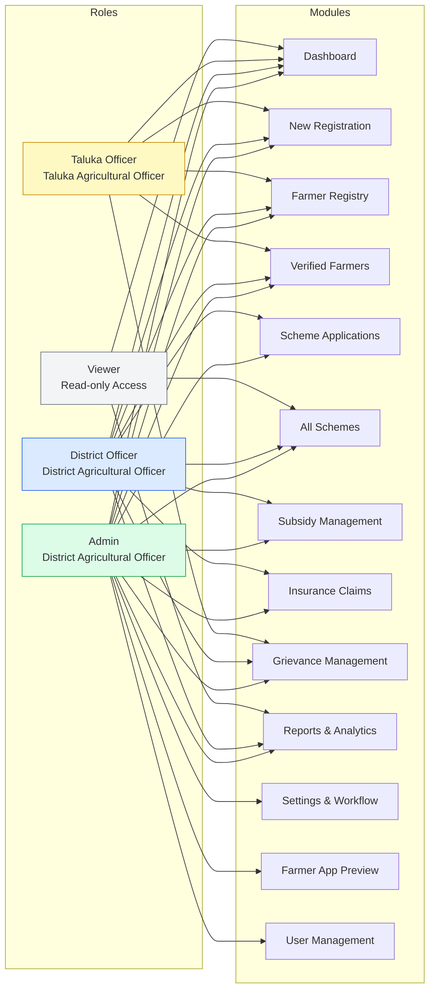
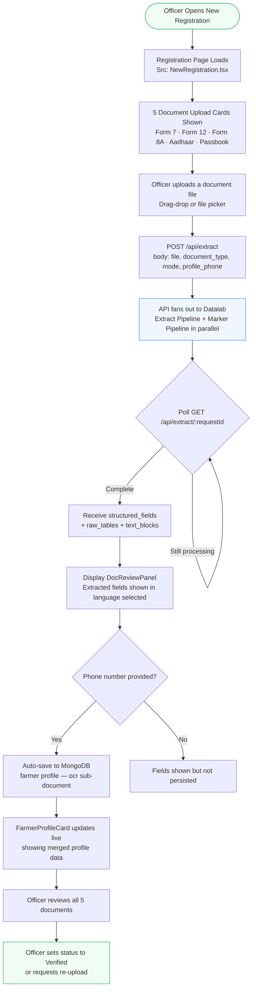
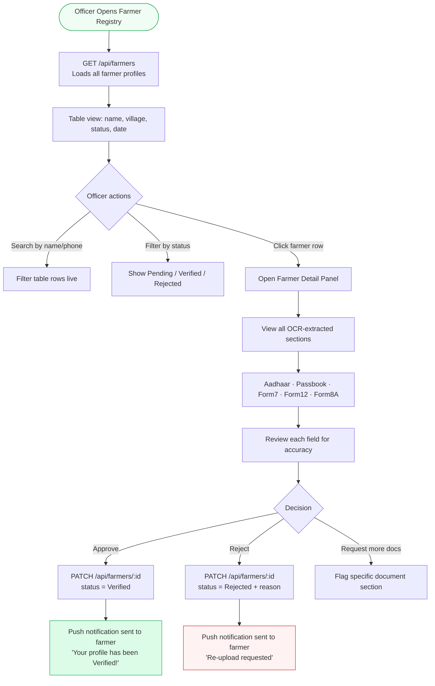
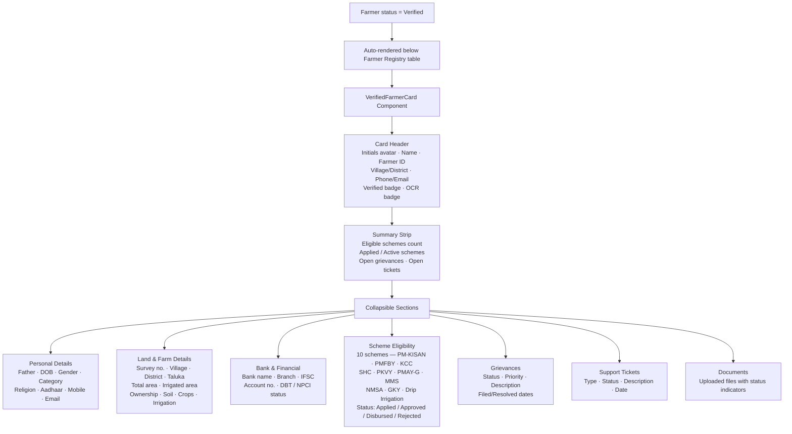
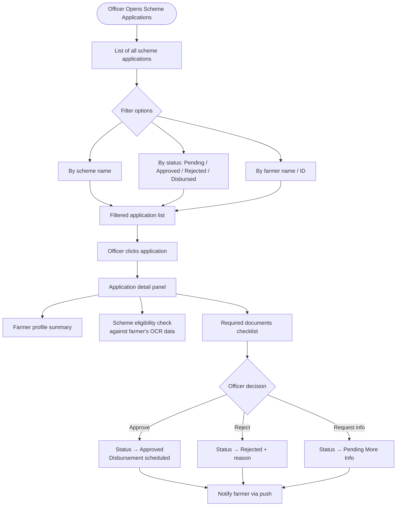
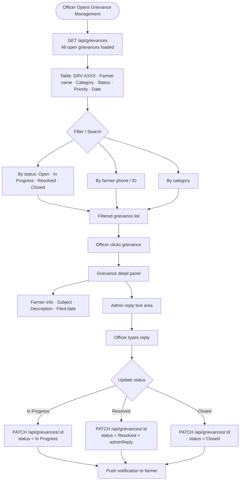
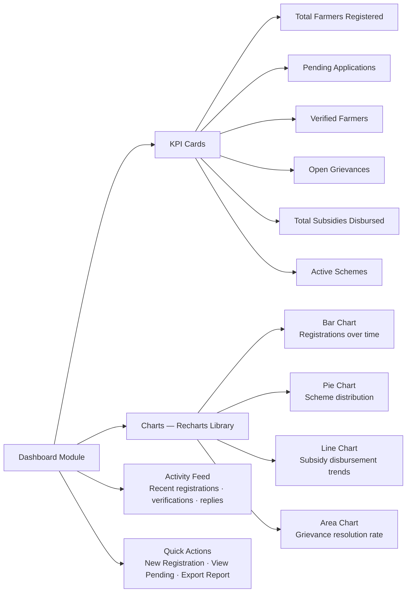
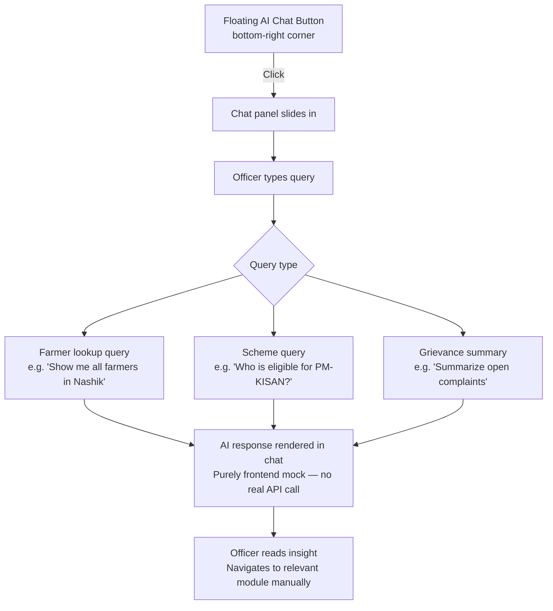
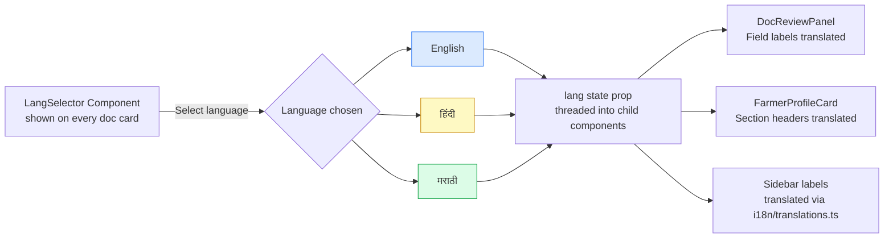

# Krushi Suvidha AI — Admin Panel Flow

## Overview

The Admin Panel is a **React + Vite** single-page application running at port 5000. It is accessed by government officers via a browser. It provides tools to manage farmer registrations, verify OCR-extracted documents, process scheme applications, manage subsidies, handle insurance claims, and resolve grievances.

---

## Admin Login & Auth Flow

---

## Role-Based Access Control

---

## New Registration Flow (OCR-Driven)

---

## Farmer Registry — Review & Verification Flow

---

## Verified Farmers Section

---

## Scheme Applications Flow

---

## Grievance Management Flow

---

## Dashboard KPIs & Analytics

---

## AI Assistant Widget

---

## Language Switching

---

## Admin Panel UI Design Specifications

### Color Palette
| Token | Hex | Usage |
|---|---|---|
| Primary Green | `#16a34a` | Buttons, active states, badges |
| Dark Green | `#14532d` | Sidebar background, brand panel |
| Gold / Amber | `#ca8a04` | Logo accent, highlights |
| White | `#ffffff` | Card backgrounds, form fields |
| Light Gray | `#f9fafb` | Page background |
| Red | `#dc2626` | Error states, rejected status |
| Blue | `#2563eb` | Info states, links |

### Typography
| Element | Font | Weight | Size |
|---|---|---|---|
| Brand logo | DM Serif Display | 700 | 28px+ |
| Page headings | DM Sans | 700 | 24px |
| Card titles | DM Sans | 600 | 16px |
| Body text | DM Sans | 400 | 14px |
| Table data | DM Sans | 400 | 13px |
| Badges | DM Sans | 600 | 11px |

### Key UI Components
- **Sidebar**: Fixed left, collapsible, dark green background, white icons, active item highlighted in bright green
- **Cards**: White background, subtle shadow (`shadow-sm`), rounded corners (`rounded-xl`)
- **Status Badges**: Pill-shaped, color-coded (green=verified, yellow=pending, red=rejected, blue=in progress)
- **Tables**: Striped rows, hover highlight, sticky header
- **Modals**: Centered overlay with backdrop blur
- **Toasts**: Bottom-right corner, auto-dismiss after 4 seconds
