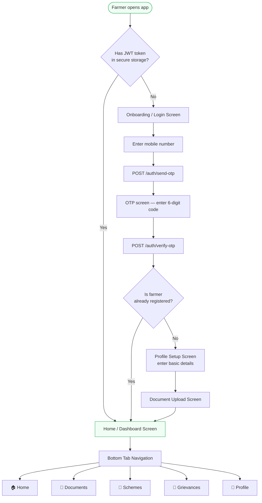
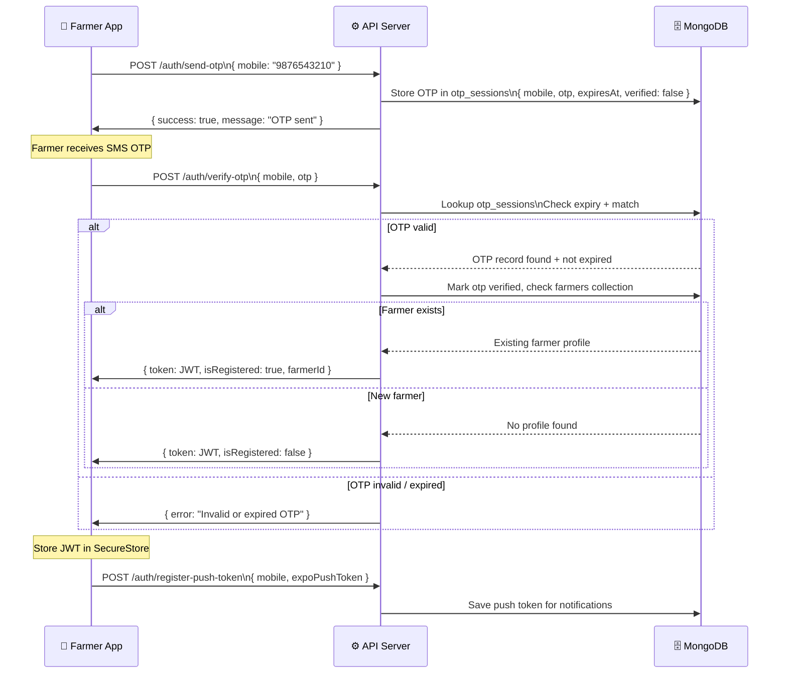
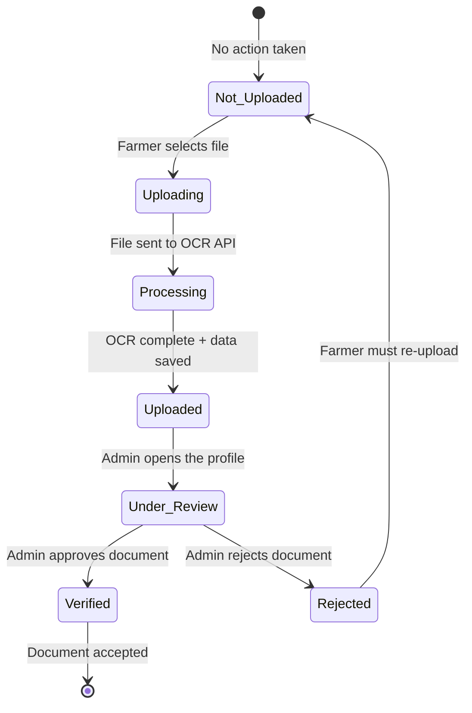
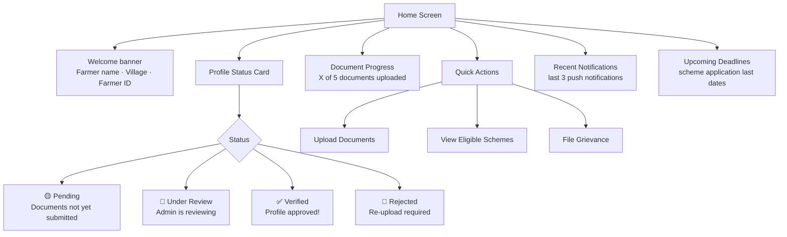
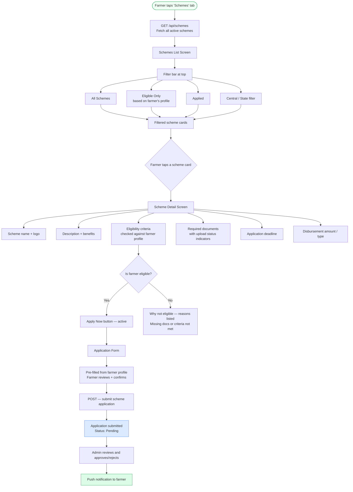
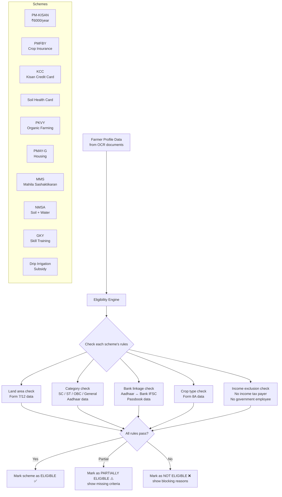
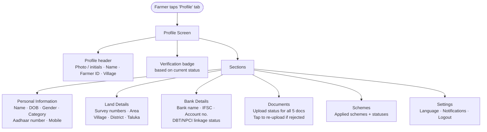

# Krushi Suvidha AI — Mobile App Flow

## Overview

The Farmer Mobile App (built with **Expo / React Native**) is the primary interface for farmers. It allows them to:
1. Register and verify their identity via OTP
2. Upload agricultural documents (Aadhaar, land records, bank passbook)
3. View their verification status
4. Browse schemes and subsidies they are eligible for
5. Apply for government schemes directly
6. File and track grievances

The app communicates with the same backend API server used by the Admin Panel.

---

## Mobile App — Full Navigation Structure



---

## OTP Authentication Flow (Detailed)



---

## Document Upload Flow (Farmer Side)

```mermaid
flowchart TD
    A([Farmer taps 'Documents' tab]) --> B[Document Upload Screen]
    B --> C[5 document cards shown]
    C --> C1[📋 Aadhaar Card]
    C --> C2[🏦 Bank Passbook]
    C --> C3[📜 Form 7 — Satbara]
    C --> C4[📜 Form 12 — Hakkpatra]
    C --> C5[📜 Form 8A — Khate Utara]

    C1 & C2 & C3 & C4 & C5 --> D[Farmer taps a card]
    D --> E{Upload method}
    E -->|Camera| F[Open device camera\ncapture document photo]
    E -->|Gallery| G[Open image picker\nchoose from photos]
    E -->|File| H[Open file picker\nchoose PDF or image]

    F & G & H --> I[POST /api/extract\n{ file, document_type,\n  mode, profile_phone }]
    I --> J[Show upload progress spinner]
    J --> K[Poll GET /api/extract/:requestId\nevery 2 seconds]
    K -->|Processing| K
    K -->|Complete| L[Show extracted fields\nto farmer for review]
    L --> M{Farmer confirms data is correct?}
    M -->|Yes| N[Data auto-saved to profile\nDocument marked as Uploaded ✓]
    M -->|No| O[Farmer re-captures document]
    O --> D

    style A fill:#f0fdf4,stroke:#16a34a
    style N fill:#dcfce7,stroke:#16a34a
```

---

## Document Status Tracking



---

## Home Dashboard Screen (Farmer)



---

## Scheme Discovery & Application Flow



---

## Scheme Eligibility Logic



---

## Grievance Filing & Tracking Flow

```mermaid
flowchart TD
    A([Farmer taps 'Grievances' tab]) --> B[Grievance List Screen]
    B --> C[Past grievances shown\nGRV-XXXX · Category · Status · Date]

    C --> D[Farmer taps '+ New Grievance']
    D --> E[Grievance Form]
    E --> F[Select category\nDocument · Payment · Scheme · Technical · Other]
    F --> G[Enter subject — short title]
    G --> H[Enter description — detailed]
    H --> I[Optional: attach photo / file]
    I --> J[POST /api/grievances\n{ mobile, farmerId, category,\n  subject, description }]
    J --> K[Grievance created\nID: GRV-XXXX]
    K --> L[Confirmation screen\nGrievance submitted successfully]

    B --> M[Farmer taps existing grievance]
    M --> N[Grievance Detail Screen]
    N --> O[Status timeline]
    O --> O1[🔴 Open — filed date]
    O --> O2[🔵 In Progress — admin picked up]
    O --> O3[🟢 Resolved — admin replied]
    O --> O4[⚫ Closed]

    N --> P[Admin reply shown\nif status = Resolved]
    N --> Q[Push notification history]

    style A fill:#f0fdf4,stroke:#16a34a
    style L fill:#dcfce7,stroke:#16a34a
```

---

## Profile Screen



---

## Push Notification Events

| Event | Trigger | Message |
|---|---|---|
| Profile Verified | Admin sets status = Verified | "🎉 Your profile has been verified! You are now eligible for schemes." |
| Profile Rejected | Admin sets status = Rejected | "⚠️ Your profile requires attention. Please re-upload the requested documents." |
| Document Rejected | Admin flags a specific doc | "📄 Your Aadhaar document was rejected. Please re-upload a clear copy." |
| Scheme Approved | Admin approves scheme application | "✅ Your PM-KISAN application has been approved!" |
| Scheme Rejected | Admin rejects scheme application | "❌ Your PMFBY application was rejected. Reason: [reason]" |
| Grievance Update | Admin updates grievance status | "📣 Your grievance GRV-0042 has been resolved." |
| New Scheme Available | Admin activates a new scheme | "🌾 A new scheme 'Drip Irrigation Subsidy' is now available. Check your eligibility!" |

---

## Mobile App UI Design Specifications

### Color Palette (follows admin panel branding)
| Token | Hex | Usage |
|---|---|---|
| Primary Green | `#16a34a` | Primary actions, verified badges, active tabs |
| Dark Green | `#14532d` | Headers, status bars |
| Gold / Amber | `#ca8a04` | Logo, accent elements |
| Light Green | `#f0fdf4` | Screen backgrounds |
| White | `#ffffff` | Cards, input fields |
| Red | `#dc2626` | Errors, rejected status |
| Blue | `#2563eb` | Links, in-progress status |

### Typography
| Element | Font | Weight | Size |
|---|---|---|---|
| Screen titles | DM Serif Display | 700 | 22px |
| Section headers | DM Sans | 600 | 18px |
| Body / labels | DM Sans | 400 | 15px |
| Captions | DM Sans | 400 | 12px |
| Buttons | DM Sans | 600 | 16px |

### UI Patterns
- **Bottom Tab Bar**: 5 tabs — Home · Documents · Schemes · Grievances · Profile
- **Status Pills**: Rounded pill badges, color-coded by status
- **Document Cards**: White card with upload icon, tap to upload, green checkmark when done
- **Progress Bar**: Document upload progress — "3 of 5 documents uploaded"
- **OTP Input**: 6 separate digit boxes, auto-advance on input
- **Pull to Refresh**: All list screens support pull-to-refresh
- **Empty States**: Illustrated empty states with action buttons when no data
- **Loading Skeletons**: Shimmer loading placeholders while API data loads
