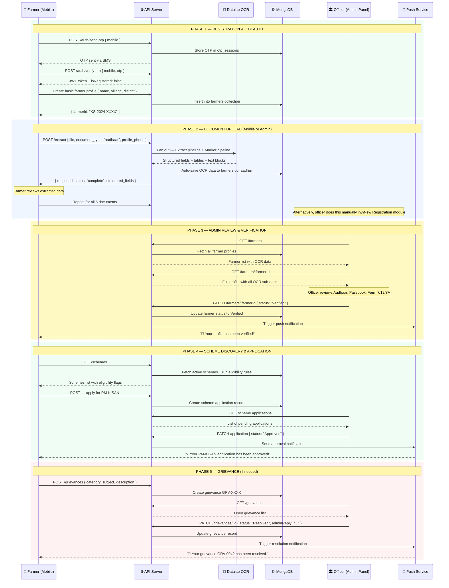
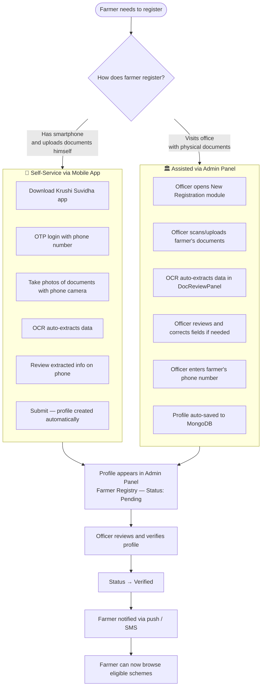
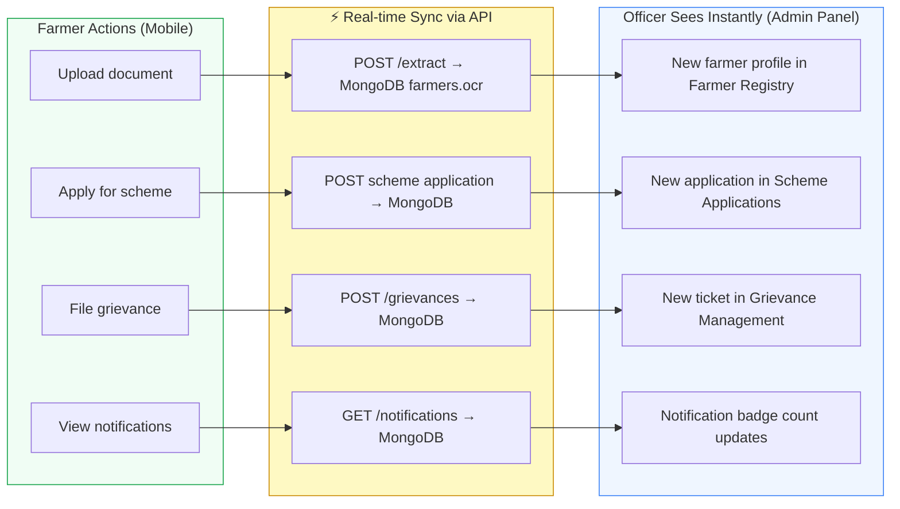
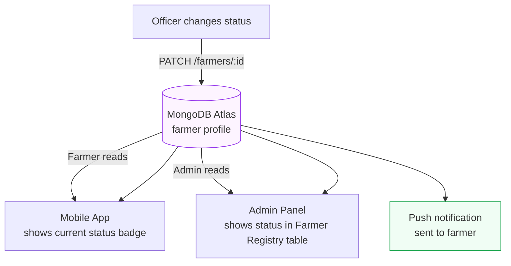
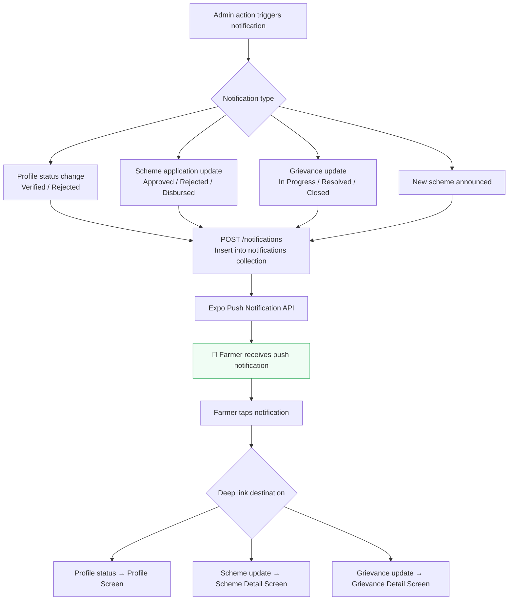
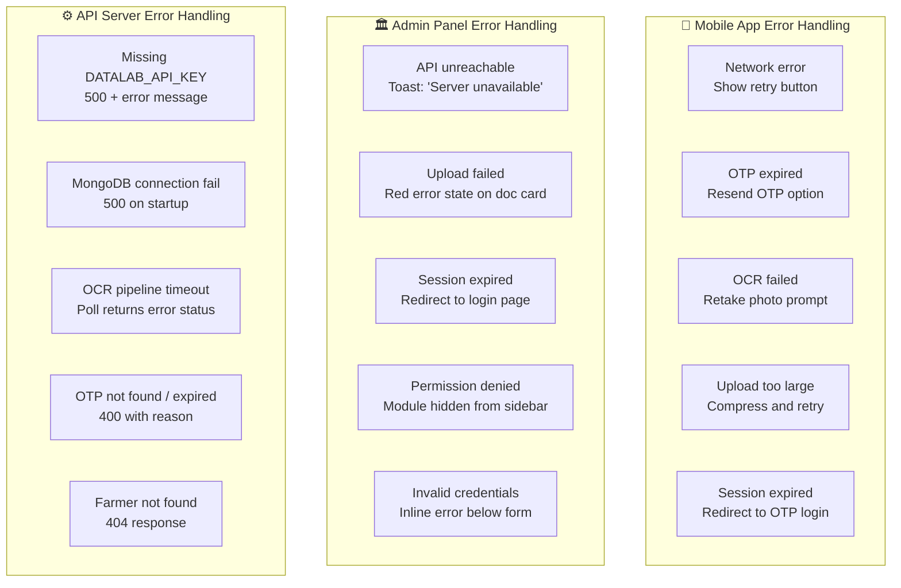

# Krushi Suvidha AI — Combined Admin + Mobile App Flow

## Overview

This document shows how the **Farmer Mobile App** and the **Admin Web Panel** interact with each other through the shared backend API. It covers the full lifecycle from farmer onboarding to scheme disbursement, showing how both sides of the system work together in real time.

---

## Full System Architecture — Both Sides

```mermaid
flowchart TD
    subgraph Mobile["📱 Farmer Mobile App (Expo / React Native)"]
        M1[OTP Login Screen]
        M2[Document Upload]
        M3[Home Dashboard]
        M4[Scheme Browser]
        M5[Grievance Module]
        M6[Profile Screen]
    end

    subgraph Admin["🏛️ Admin Web Panel (React + Vite)"]
        A1[Login Page]
        A2[New Registration Module]
        A3[Farmer Registry]
        A4[Verified Farmers]
        A5[Scheme Applications]
        A6[Grievance Management]
        A7[Dashboard & Reports]
    end

    subgraph API["⚙️ API Server (Node.js + Express — Port 8000)"]
        R1[/auth routes]
        R2[/extract routes]
        R3[/farmers routes]
        R4[/schemes routes]
        R5[/grievances routes]
        R6[/notifications routes]
    end

    subgraph External["🌐 External Services"]
        OCR[Datalab AI\nExtract + Marker]
        PUSH[Expo Push\nNotification Service]
        SMS[SMS Gateway\nOTP Delivery]
    end

    subgraph DB["🗄️ MongoDB Atlas (apnaapp DB)"]
        C1[(farmers)]
        C2[(schemes)]
        C3[(grievances)]
        C4[(notifications)]
        C5[(otp_sessions)]
    end

    Mobile <-->|HTTPS REST| API
    Admin <-->|HTTPS REST| API
    API <-->|Read / Write| DB
    API -->|Document processing| OCR
    OCR -->|Structured data| API
    API -->|Push| PUSH
    PUSH -->|Notification| Mobile
    API -->|OTP| SMS
    SMS -->|6-digit code| Mobile

    style Mobile fill:#f0fdf4,stroke:#16a34a
    style Admin fill:#eff6ff,stroke:#3b82f6
    style API fill:#fef9c3,stroke:#ca8a04
    style External fill:#f3f4f6,stroke:#6b7280
    style DB fill:#fdf4ff,stroke:#9333ea
```

---

## Complete Farmer Journey — End to End



---

## Two Entry Paths — Mobile vs In-Person at Office



---

## Data Synchronisation Points



---

## Status Mirrors — Both Sides See the Same Data



---

## Notification Flow — Both Directions



---

## Side-by-Side Feature Mapping

| Feature | Mobile App | Admin Panel |
|---|---|---|
| **Authentication** | OTP (SMS) → JWT | Email + Password → localStorage session |
| **Registration** | Self-service with camera | Assisted with scanner/upload |
| **Document Upload** | Camera / gallery / file picker | File picker / scanner |
| **OCR Review** | View extracted fields on phone | Review in DocReviewPanel with language switching |
| **Verification** | View status, can't change it | Can verify/reject — full control |
| **Scheme Browse** | Filter by eligibility | View all + manage status |
| **Scheme Apply** | Apply button in app | Submit on behalf of farmer |
| **Grievance File** | Fill form in app | Create manually for farmer |
| **Grievance Resolve** | Read-only — see reply | Full edit — status + adminReply |
| **Language Support** | Marathi / Hindi / English | Marathi / Hindi / English |
| **Push Notifications** | Receive notifications | Send / manage notification system |
| **Analytics** | Personal stats only | District-wide analytics + charts |

---

## Error Handling — Both Sides


