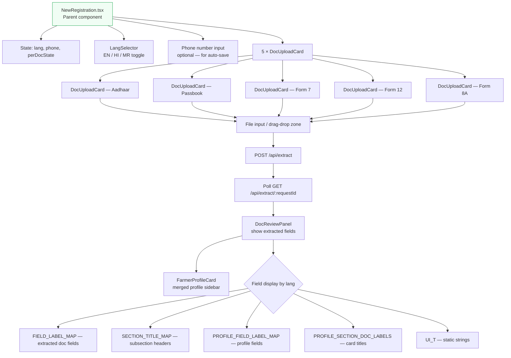
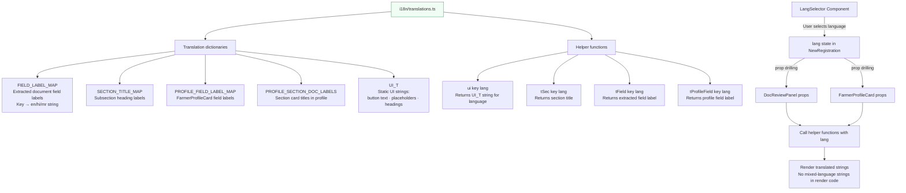
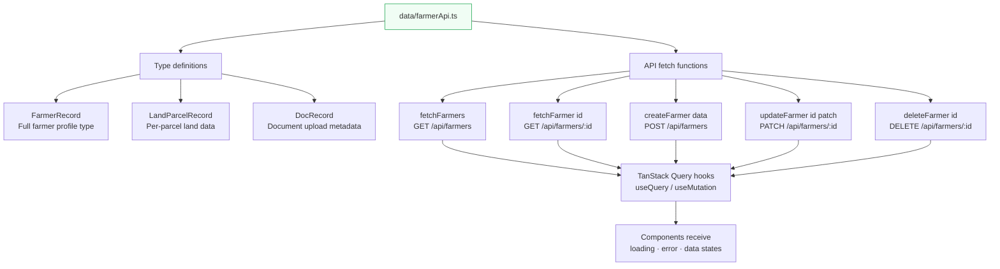
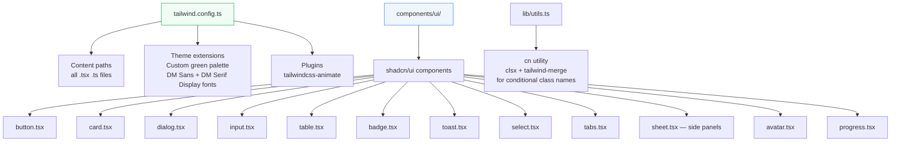
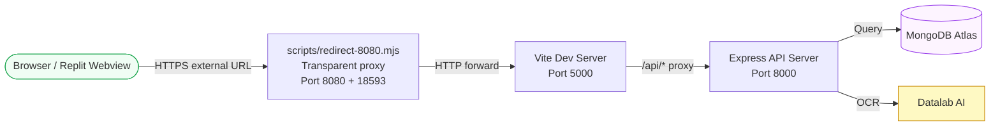

# Krushi Suvidha AI — Frontend Architecture

## Overview

The Admin Panel frontend is a **React 18 + Vite** single-page application (SPA). It uses **Tailwind CSS v3** for styling, **shadcn/ui** for pre-built components, **TanStack Query** for server state, **React Router DOM** for routing, and the **Context API** for global client state.

The Mobile App frontend is an **Expo / React Native** app sharing the same API contract and design language as the admin panel.

---

## Admin Panel — File & Folder Structure

```mermaid
flowchart TD
    Root[artifacts/agri-admin/src/] --> A[main.tsx\nApp entry point]
    Root --> B[App.tsx\nRouter + Providers setup]
    Root --> C[pages/]
    Root --> D[components/]
    Root --> E[contexts/]
    Root --> F[data/]
    Root --> G[i18n/]
    Root --> H[hooks/]
    Root --> I[lib/]

    C --> C1[Index.tsx\nMain SPA shell — module switcher]
    C --> C2[LoginPage.tsx\nAuth gate]
    C --> C3[NotFound.tsx\n404 page]

    D --> D1[layout/\nSidebar.tsx · Header.tsx]
    D --> D2[modules/\nAll feature modules]
    D --> D3[ui/\nshadcn/ui component library]
    D --> D4[AIAssistant.tsx\nFloating chat widget]

    D2 --> D2a[Dashboard.tsx]
    D2 --> D2b[NewRegistration.tsx]
    D2 --> D2c[FarmerRegistry.tsx]
    D2 --> D2d[VerifiedFarmerCard.tsx]
    D2 --> D2e[SchemeApplications.tsx]
    D2 --> D2f[AllSchemes.tsx]
    D2 --> D2g[SubsidyManagement.tsx]
    D2 --> D2h[InsuranceClaims.tsx]
    D2 --> D2i[GrievanceManagement.tsx]
    D2 --> D2j[ReportsAnalytics.tsx]
    D2 --> D2k[SettingsWorkflow.tsx]
    D2 --> D2l[UserManagement.tsx]
    D2 --> D2m[MyProfile.tsx]
    D2 --> D2n[FarmerAppPreview.tsx]

    E --> E1[AuthContext.tsx]
    E --> E2[LanguageContext.tsx]
    E --> E3[NotificationContext.tsx]

    F --> F1[farmerApi.ts\nAPI client functions]
    F --> F2[dummyData.ts\nStatic/mock data]

    G --> G1[translations.ts\nen/hi/mr strings]

    style Root fill:#f0fdf4,stroke:#16a34a
```



---

## Component Hierarchy — Runtime Tree

```mermaid
flowchart TD
    A[main.tsx\nReactDOM.createRoot] --> B[App.tsx]

    B --> P1[QueryClientProvider\nTanStack Query]
    P1 --> P2[TooltipProvider]
    P2 --> P3[Toaster\nToast notifications]
    P3 --> P4[Sonner\nSonner toasts]
    P4 --> P5[BrowserRouter]
    P5 --> P6[AuthProvider]
    P6 --> P7[LanguageProvider]
    P7 --> P8[NotificationProvider]
    P8 --> P9[AppRoutes]

    P9 --> Q{Is user logged in?}
    Q -->|No| LG[LoginPage.tsx]
    Q -->|Yes| RT[Routes]

    RT --> R1[/ → Index.tsx]
    RT --> R2[* → NotFound.tsx]

    R1 --> L[Layout Shell]
    L --> L1[Sidebar.tsx\nFixed left nav]
    L --> L2[Header.tsx\nTop bar]
    L --> L3[Main Content Area]
    L --> L4[AIAssistant.tsx\nFloating widget]

    L3 --> M{active module state}
    M --> M1[Dashboard]
    M --> M2[NewRegistration]
    M --> M3[FarmerRegistry]
    M --> M4[VerifiedFarmers]
    M --> M5[SchemeApplications]
    M --> M6[AllSchemes]
    M --> M7[SubsidyManagement]
    M --> M8[InsuranceClaims]
    M --> M9[GrievanceManagement]
    M --> M10[ReportsAnalytics]
    M --> M11[SettingsWorkflow]
    M --> M12[UserManagement]
    M --> M13[FarmerAppPreview]

    style A fill:#f0fdf4,stroke:#16a34a
```

---

## State Management Architecture

```mermaid
flowchart TD
    subgraph GlobalState["🌐 Global State — React Context"]
        AC[AuthContext\nCurrentUser · Users · Permissions\nlogin() · logout() · can()]
        LC[LanguageContext\nlang: en / hi / mr\nsetLang()]
        NC[NotificationContext\nnotifications[] · unreadCount\nmarkRead() · clearAll()]
    end

    subgraph ServerState["☁️ Server State — TanStack Query"]
        QC[QueryClient\nconfigured in App.tsx]
        Q1[useQuery\nGET /api/farmers]
        Q2[useQuery\nGET /api/schemes]
        Q3[useQuery\nGET /api/grievances]
        Q4[useMutation\nPATCH /api/farmers/:id]
        Q5[useMutation\nPOST /api/extract]
    end

    subgraph LocalState["📦 Local State — useState / useReducer"]
        LS1[active module\nin Index.tsx]
        LS2[form fields\nin NewRegistration.tsx]
        LS3[selected farmer\nin FarmerRegistry.tsx]
        LS4[chat messages\nin AIAssistant.tsx]
        LS5[collapsed sidebar\nin Sidebar.tsx]
        LS6[search/filter terms\nin list modules]
    end

    subgraph Persistence["💾 Persistence — localStorage"]
        PS1[agri_users_v1\nAll user records]
        PS2[agri_session_v1\nCurrent session userId]
    end

    AC <--> PS1
    AC <--> PS2
    QC --> Q1 & Q2 & Q3 & Q4 & Q5

    style GlobalState fill:#f0fdf4,stroke:#16a34a
    style ServerState fill:#eff6ff,stroke:#3b82f6
    style LocalState fill:#fef9c3,stroke:#ca8a04
    style Persistence fill:#fdf4ff,stroke:#9333ea
```

---

## AuthContext — Detailed Internal Flow

```mermaid
flowchart TD
    A[App starts] --> B[AuthProvider mounts]
    B --> C[loadUsers() from localStorage\nagri_users_v1]
    C --> D{Users found in localStorage?}
    D -->|Yes| E[Use stored users]
    D -->|No| F[Use SEED_USERS\n3 demo accounts]

    E & F --> G[loadSession() from localStorage\nagri_session_v1]
    G --> H{Session ID found?}
    H -->|Yes| I[Restore session — currentUser from users list]
    H -->|No| J[currentUser = null → Show LoginPage]

    I & J --> K[AuthProvider renders children]

    K --> L{Login action}
    L -->|login email + password| M[Find user by email]
    M --> N{User found?}
    N -->|No| O[Return error: 'No account found']
    N -->|Yes| P{Account active?}
    P -->|No| Q[Return error: 'Account deactivated']
    P -->|Yes| R{Password hash matches?}
    R -->|No| S[Return error: 'Incorrect password']
    R -->|Yes| T[Update lastLogin\nSave session\nSet currentUser]

    T --> U[Sidebar renders with role-filtered items]
    U --> V[can section checks permissions object]

    style A fill:#f0fdf4,stroke:#16a34a
    style T fill:#dcfce7,stroke:#16a34a
    style O & Q & S fill:#fef2f2,stroke:#dc2626
```

---

## New Registration Module — Component Architecture



---

## Translation System Architecture



---

## API Client — farmerApi.ts



---

## Vite Build & Dev Configuration

```mermaid
flowchart LR
    A[vite.config.ts] --> B[Server config\nhost: 0.0.0.0\nport: 5000]
    A --> C[Proxy config\n/api → http://localhost:8000\nrewriteBasePath: true]
    A --> D[Plugins\n@vitejs/plugin-react\nfor React Fast Refresh]
    A --> E[Aliases\n@ → src/]
    A --> F[Build output\ndist/ folder\nchunk splitting]

    B --> G[Dev server accessible\nvia Replit proxy on port 8080]
    C --> H[Frontend API calls proxied\nto Express API server]

    style A fill:#f0fdf4,stroke:#16a34a
```

---

## Tailwind & shadcn/ui Component System



---

## Port Routing Architecture (Dev Environment)



---

## Key Design Patterns Used

| Pattern | Where Used | Purpose |
|---|---|---|
| **Provider pattern** | AuthContext, LanguageContext, NotificationContext | Global state without prop drilling |
| **Module switching** | Index.tsx active state | SPA without full page reloads |
| **Polling** | /extract/:requestId | Wait for async OCR result |
| **Optimistic UI** | Status badge updates | Instant feedback before API confirms |
| **Role-based rendering** | Sidebar, module access | Hide features based on permissions |
| **Compound components** | shadcn/ui Card, Tabs | Flexible, composable UI blocks |
| **Local storage sync** | AuthProvider useEffect | Persist users and session across refreshes |
| **Proxy forwarding** | vite.config.ts + redirect-8080.mjs | Single domain for frontend + API |
