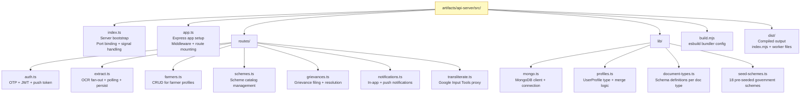
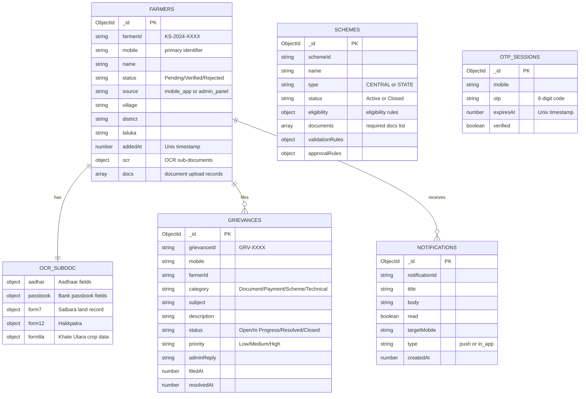
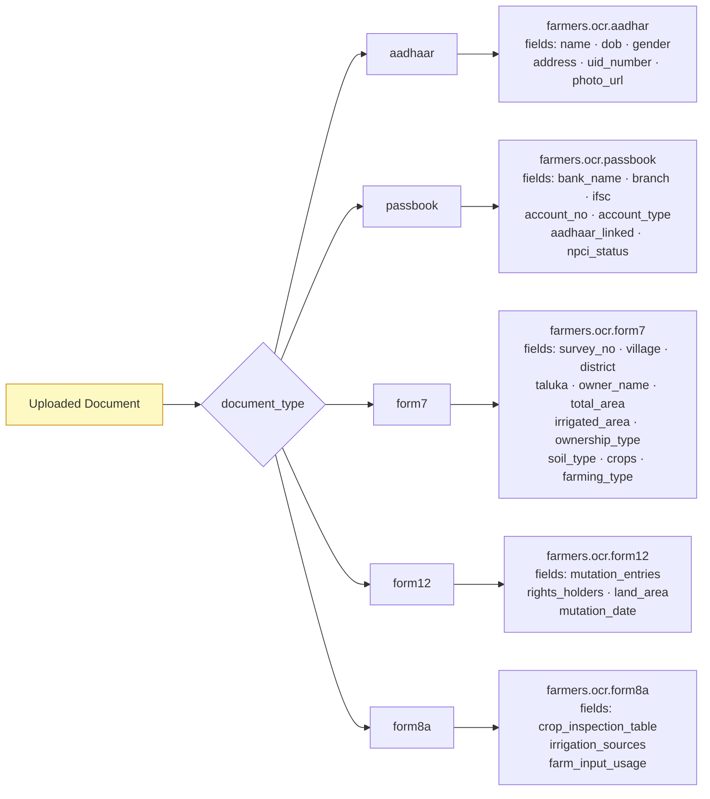
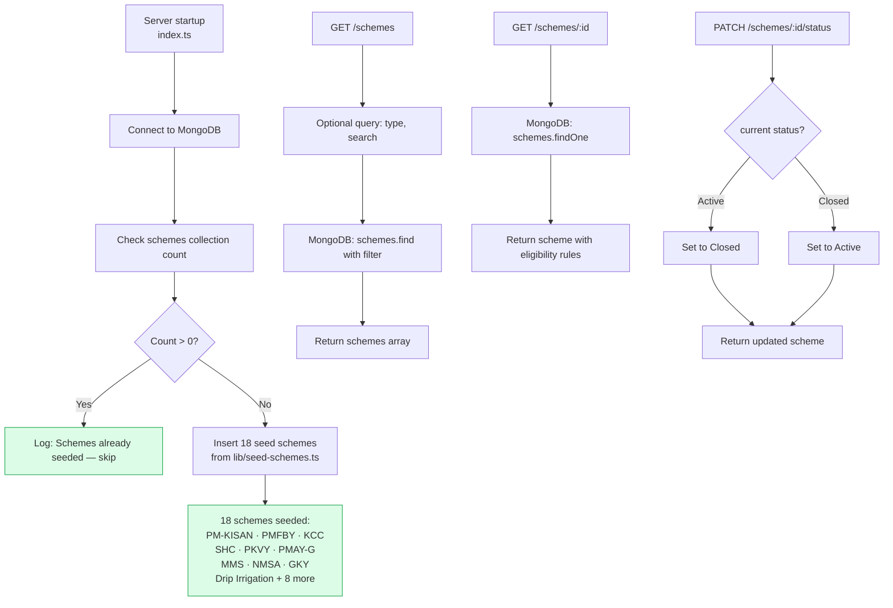
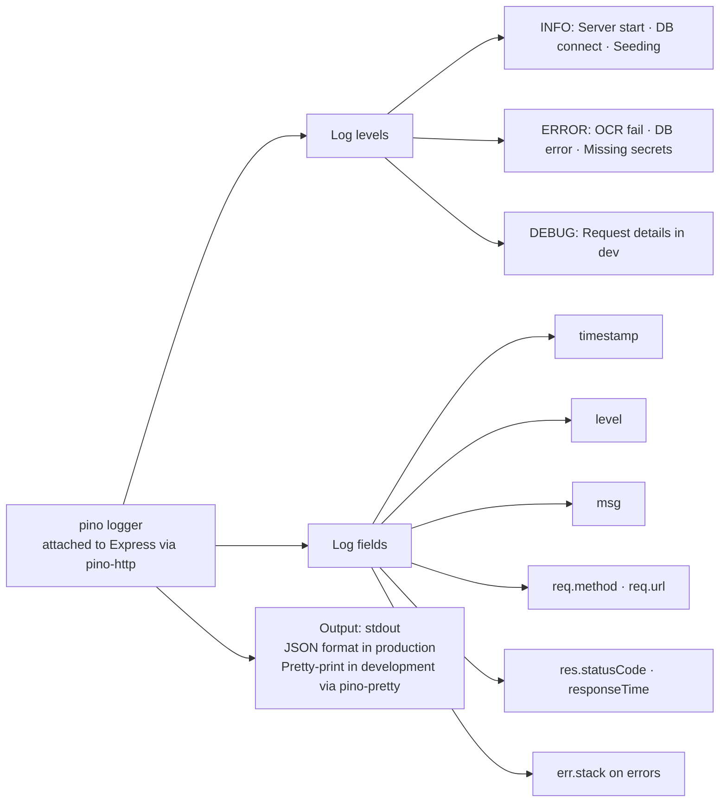

# Krushi Suvidha AI — Backend Architecture

## Overview

The backend is a **Node.js + Express 5** REST API server. It handles all data operations, document OCR orchestration, authentication, push notifications, and scheme management. It runs on **port 8000** and connects to **MongoDB Atlas** as its primary data store.

---

## Server Structure — File Layout



---

## Express App — Middleware Stack

```mermaid
flowchart TD
    A[Incoming HTTP Request] --> B[cors\nAllow all origins in dev]
    B --> C[express.json\nParse JSON body]
    C --> D[cookie-parser\nParse cookies]
    D --> E[pino-http\nRequest/response logging\nStructured JSON logs]
    E --> F[Route handlers]
    F --> G{Route matched?}
    G -->|Yes| H[Execute handler]
    G -->|No| I[404 handler\n{ error: 'Not found' }]
    H --> J{Handler threw?}
    J -->|Yes| K[Global error handler\n{ error: message }\nLog stack trace]
    J -->|No| L[Send response]

    style A fill:#fef9c3,stroke:#ca8a04
    style L fill:#dcfce7,stroke:#16a34a
    style K fill:#fef2f2,stroke:#dc2626
```

---

## MongoDB Collections & Schema



---

## OCR Extraction Pipeline — Detailed

```mermaid
flowchart TD
    A[POST /api/extract\nMultipart upload: file + document_type + mode + profile_phone] --> B[multer middleware\nBuffer file in memory]
    B --> C[Validate document_type\nagainst SUPPORTED_TYPES]
    C --> D[Generate requestId UUID]

    D --> E[Fan out in parallel]
    E --> F[Datalab Extract API\nPOST /v1/extract\nStructured field extraction\nBased on doc schema from document-types.ts]
    E --> G[Datalab Marker API\nPOST /v1/marker\nHigh-fidelity HTML + Markdown\nCaptures tables + portraits + signatures]

    F --> H[Store Extract requestId\nin memory Map]
    G --> I[Store Marker requestId\nin memory Map]

    H & I --> J[Return { requestId } to client\nClient begins polling]

    J --> K[GET /api/extract/:requestId\nclient polls every 2s]
    K --> L{Both pipelines done?}
    L -->|No| M[Return { status: 'processing' }]
    M --> K
    L -->|Yes| N[Parse Extract JSON → structured_fields]
    N --> O[Parse Marker JSON → raw_tables + text_blocks]
    O --> P{profile_phone provided?}
    P -->|Yes| Q[persistToProfile\nMap fields to ProfileSection\nMerge into farmers collection]
    P -->|No| R[Return data without persisting]
    Q --> S[Return { status: 'complete',\nstructured_fields,\nraw_tables,\ntext_blocks }]
    R --> S

    style A fill:#fef9c3,stroke:#ca8a04
    style S fill:#dcfce7,stroke:#16a34a
    style F fill:#eff6ff,stroke:#3b82f6
    style G fill:#eff6ff,stroke:#3b82f6
```

---

## OCR Field Mapping — Document Type to Profile Section



---

## Auth Routes — OTP Flow

```mermaid
flowchart TD
    A[POST /auth/send-otp\n{ mobile }] --> B[Validate: 10-digit Indian mobile]
    B --> C[Generate 6-digit OTP\nMath.random]
    C --> D[Store in otp_sessions\n{ mobile, otp, expiresAt: now+5min, verified: false }]
    D --> E[Send OTP via SMS\nGateway integration]
    E --> F[Return { success: true }]

    G[POST /auth/verify-otp\n{ mobile, otp }] --> H[Lookup otp_sessions by mobile]
    H --> I{Record found?}
    I -->|No| J[400: OTP not found]
    I -->|Yes| K{Expired?}
    K -->|Yes| L[400: OTP expired]
    K -->|No| M{OTP matches?}
    M -->|No| N[400: Invalid OTP]
    M -->|Yes| O[Mark verified in DB]
    O --> P[Lookup farmers by mobile]
    P --> Q{Farmer exists?}
    Q -->|Yes| R[Return JWT + { isRegistered: true, farmerId }]
    Q -->|No| S[Return JWT + { isRegistered: false }]

    T[POST /auth/register-push-token\n{ mobile, expoPushToken }] --> U[Upsert push token\ninto notifications collection]
    U --> V[Return { success: true }]

    style F & R & S & V fill:#dcfce7,stroke:#16a34a
    style J & L & N fill:#fef2f2,stroke:#dc2626
```

---

## Farmers CRUD Routes

```mermaid
flowchart TD
    A[GET /farmers] --> B[MongoDB: farmers.find\nSort by addedAt desc]
    B --> C[Return array of farmer profiles]

    D[GET /farmers/:id] --> E[MongoDB: farmers.findOne\n{ farmerId: id }]
    E --> F{Found?}
    F -->|No| G[404: Farmer not found]
    F -->|Yes| H[Return full profile with OCR]

    I[POST /farmers\n{ name, mobile, village, district, ... }] --> J[Generate farmerId: KS-YYYY-XXXX]
    J --> K[MongoDB: farmers.insertOne]
    K --> L[Return { farmerId, ...profile }]

    M[PATCH /farmers/:id\n{ status, ...fields }] --> N[MongoDB: farmers.updateOne\n$set patch fields]
    N --> O{Modified?}
    O -->|No| P[404: Not found]
    O -->|Yes| Q{Status changed to Verified?}
    Q -->|Yes| R[Trigger push notification\n'Profile Verified!']
    Q -->|No| S[Return updated profile]
    R --> S

    T[DELETE /farmers/:id] --> U[MongoDB: farmers.deleteOne]
    U --> V[Return { deleted: true }]

    style C & H & L & S & V fill:#dcfce7,stroke:#16a34a
    style G & P fill:#fef2f2,stroke:#dc2626
```

---

## Schemes Routes & Seeding



---

## Grievances Routes

```mermaid
flowchart TD
    A[POST /grievances\n{ mobile, farmerId, category,\n  subject, description, priority }] --> B[Generate grievanceId\nGRV- padded 4-digit counter]
    B --> C[MongoDB: grievances.insertOne\n{ status: 'Open', filedAt: now }]
    C --> D[Return { grievanceId, ...grievance }]

    E[GET /grievances] --> F[Optional filters: mobile, farmerId, status]
    F --> G[MongoDB: grievances.find with filter\nSort by filedAt desc]
    G --> H[Return grievances array]

    I[PATCH /grievances/:id\n{ status, adminReply }] --> J[MongoDB: grievances.updateOne\n$set status + adminReply\nIf Resolved: set resolvedAt]
    J --> K{Status changed to Resolved?}
    K -->|Yes| L[Trigger push notification\n'Grievance resolved']
    K -->|No| M[Return updated grievance]
    L --> M

    style D & H & M fill:#dcfce7,stroke:#16a34a
```

---

## Build System — esbuild Configuration

```mermaid
flowchart TD
    A[build.mjs\nesbuild config] --> B[Entry: src/index.ts]
    B --> C[Bundle: true\nAll deps included]
    C --> D[Platform: node]
    D --> E[Format: ESM\noutput: dist/index.mjs]
    E --> F[Sourcemaps: linked\nfor --enable-source-maps]
    F --> G[External: []\nEverything bundled\nexcept native addons]

    G --> H[Worker files bundled separately]
    H --> H1[dist/pino-worker.mjs]
    H --> H2[dist/pino-file.mjs]
    H --> H3[dist/pino-pretty.mjs]
    H --> H4[dist/thread-stream-worker.mjs]

    I[pnpm run build] --> A
    I --> J[Output: dist/ folder\n3.4mb main bundle]
    J --> K[Startup command\nnode --enable-source-maps ./dist/index.mjs]

    style A fill:#fef9c3,stroke:#ca8a04
```

---

## Logging — Pino Structured Logger



---

## Environment Variables Required

| Variable | Type | Required | Purpose |
|---|---|---|---|
| `MONGODB_URI` | Secret | **Yes** | MongoDB Atlas connection string |
| `DATALAB_API_KEY` | Secret | **Yes** | Datalab OCR pipeline authentication |
| `MONGODB_DB` | Env var | Yes | Database name (default: `apnaapp`) |
| `PORT` | Env var | No | API server port (default: `8000`) |
| `NODE_ENV` | Env var | No | `development` or `production` |

---

## Error Handling Strategy

```mermaid
flowchart TD
    A[Request arrives] --> B{Validation passes?}
    B -->|No| C[400 Bad Request\n{ error: 'descriptive message' }]
    B -->|Yes| D{Resource exists?}
    D -->|No| E[404 Not Found\n{ error: 'X not found' }]
    D -->|Yes| F{External service available?}
    F -->|DATALAB_API_KEY missing| G[500\n{ error: 'Server is missing DATALAB_API_KEY' }]
    F -->|MongoDB down| H[500\n{ error: 'Database error' }]
    F -->|Yes| I[Process request]
    I --> J{Success?}
    J -->|Yes| K[200/201 with data]
    J -->|Unexpected error| L[500 + log full stack via pino]

    style C & E & G & H & L fill:#fef2f2,stroke:#dc2626
    style K fill:#dcfce7,stroke:#16a34a
```
