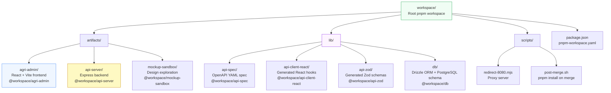
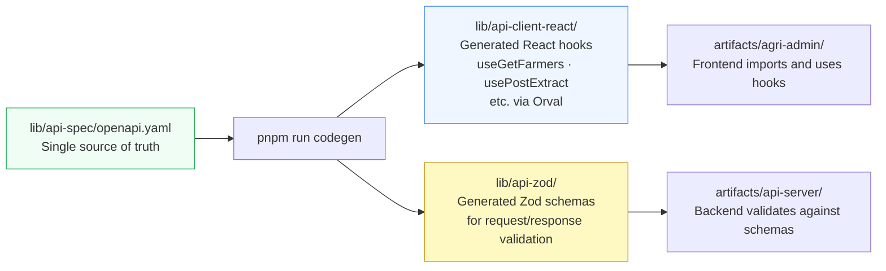
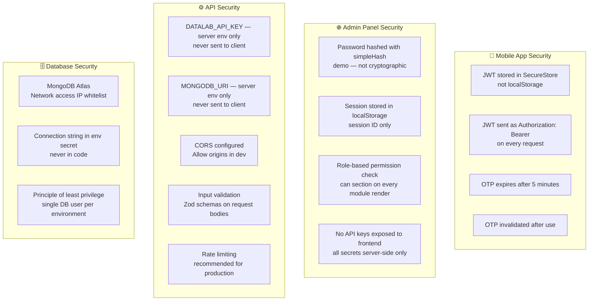
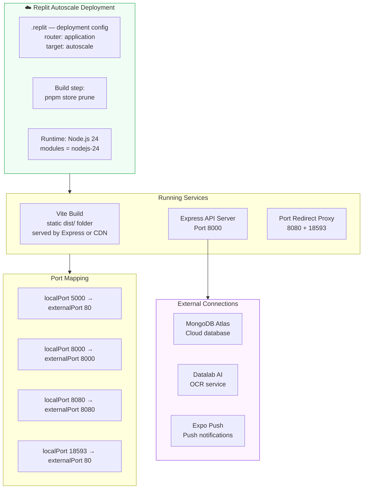
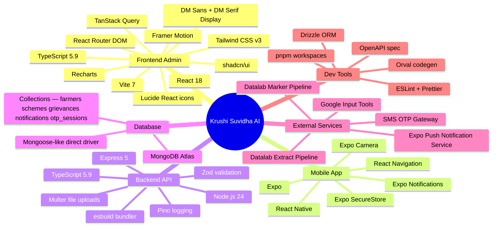
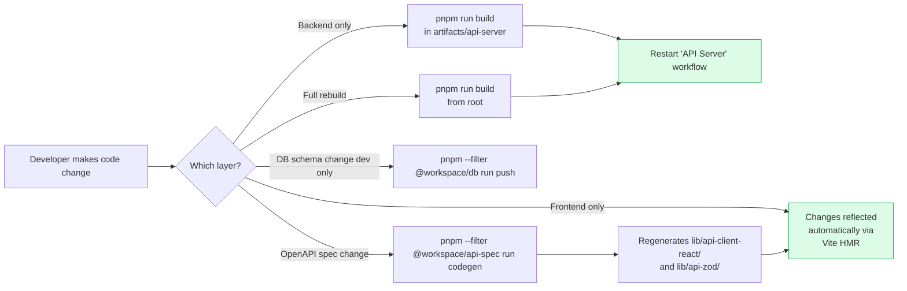

# Krushi Suvidha AI — Full Stack Architecture

## Overview

This document provides the complete picture of the entire Krushi Suvidha AI platform — frontend, backend, database, external services, infrastructure, and deployment. This is the master reference diagram document.

---

## Complete System Architecture

```mermaid
flowchart TD
    subgraph Users["👥 End Users"]
        U1[🌾 Farmer\nSmartphone]
        U2[🏛️ District Officer\nDesktop Browser]
        U3[🏛️ Taluka Officer\nDesktop Browser]
        U4[👤 Admin DAO\nDesktop Browser]
    end

    subgraph MobileApp["📱 Farmer Mobile App\nExpo / React Native"]
        MA1[OTP Auth Screen]
        MA2[Document Upload]
        MA3[Scheme Browser]
        MA4[Grievance Module]
        MA5[Profile Screen]
        MA6[Push Notification Handler]
    end

    subgraph AdminWeb["🌐 Admin Web Panel\nReact 18 + Vite — Port 5000"]
        AW1[Login Page\nLoginPage.tsx]
        AW2[Dashboard\nKPIs + Charts]
        AW3[New Registration\nOCR Upload]
        AW4[Farmer Registry\nVerification]
        AW5[Scheme Applications\nApproval workflow]
        AW6[Grievance Management\nResolution]
        AW7[Reports & Analytics\nRecharts]
        AW8[User Management\nRole-based access]
    end

    subgraph ProxyLayer["🔀 Proxy Layer\nscripts/redirect-8080.mjs"]
        PX1[Port 8080 → 5000]
        PX2[Port 18593 → 5000]
    end

    subgraph APIServer["⚙️ API Server\nNode.js + Express 5 — Port 8000"]
        API1[/auth — OTP + JWT]
        API2[/extract — OCR orchestration]
        API3[/farmers — Profile CRUD]
        API4[/schemes — Scheme catalog]
        API5[/grievances — Grievance CRUD]
        API6[/notifications — Push + in-app]
        API7[/transliterate — Marathi/Hindi proxy]
    end

    subgraph ExternalServices["🌐 External Services"]
        EXT1[Datalab AI\nExtract Pipeline\nStructured field extraction]
        EXT2[Datalab AI\nMarker Pipeline\nHTML/MD/table extraction]
        EXT3[Expo Push Notification\nService APNS + FCM]
        EXT4[SMS Gateway\nOTP delivery]
        EXT5[Google Input Tools\nTransliteration API]
    end

    subgraph Database["🗄️ MongoDB Atlas\napnaapp database"]
        DB1[(farmers)]
        DB2[(schemes)]
        DB3[(grievances)]
        DB4[(notifications)]
        DB5[(otp_sessions)]
    end

    U1 --> MobileApp
    U2 & U3 & U4 --> ProxyLayer
    ProxyLayer --> AdminWeb
    AdminWeb -->|/api/* proxy| APIServer
    MobileApp -->|HTTPS REST| APIServer
    APIServer --> Database
    APIServer --> EXT1 & EXT2
    EXT1 & EXT2 -->|Structured data| APIServer
    APIServer --> EXT3 & EXT4 & EXT5
    EXT3 -->|Push| MobileApp

    style Users fill:#f9fafb,stroke:#6b7280
    style MobileApp fill:#f0fdf4,stroke:#16a34a
    style AdminWeb fill:#eff6ff,stroke:#3b82f6
    style ProxyLayer fill:#f3f4f6,stroke:#9ca3af
    style APIServer fill:#fef9c3,stroke:#ca8a04
    style ExternalServices fill:#fdf4ff,stroke:#9333ea
    style Database fill:#fdf4ff,stroke:#9333ea
```

---

## Data Flow — Complete Request Lifecycle

```mermaid
sequenceDiagram
    participant Client as 🌐 Browser / Mobile
    participant Proxy as 🔀 Proxy (8080)
    participant Vite as ⚡ Vite (5000)
    participant Express as ⚙️ Express (8000)
    participant Mongo as 🗄️ MongoDB
    participant Datalab as 🤖 Datalab AI

    Note over Client,Datalab: Example: Farmer document upload from Admin Panel

    Client->>Proxy: POST https://app.replit.dev/api/extract
    Proxy->>Vite: Forward to port 5000
    Vite->>Express: Proxy /api/* to port 8000
    Express->>Express: multer — buffer file in memory
    Express->>Datalab: POST /v1/extract (async, non-blocking)
    Express->>Datalab: POST /v1/marker (async, non-blocking)
    Express->>Client: 202 { requestId: "uuid-xxx" }

    loop Poll every 2 seconds
        Client->>Proxy: GET /api/extract/uuid-xxx
        Proxy->>Vite->>Express: Forward
        Express->>Datalab: Check extract status
        Express->>Datalab: Check marker status
        alt Still processing
            Express->>Client: { status: "processing" }
        else Both complete
            Express->>Mongo: upsert farmers { ocr: { aadhar: ... } }
            Express->>Client: { status: "complete", structured_fields, raw_tables }
        end
    end
```

---

## Monorepo Package Structure



---

## API Contract — OpenAPI Spec Driven Development



---

## Security Architecture



---

## Deployment Architecture (Production)



---

## Technology Stack — Complete Reference



---

## Complete API Route Reference

| Method | Path | Auth | Description |
|---|---|---|---|
| `POST` | `/auth/send-otp` | None | Generate + send OTP to mobile number |
| `POST` | `/auth/verify-otp` | None | Verify OTP → return JWT |
| `POST` | `/auth/register-push-token` | JWT | Register Expo push token for farmer |
| `GET` | `/extract/document-types` | None | List 5 supported document types |
| `POST` | `/extract` | None | Upload file → start OCR pipelines |
| `GET` | `/extract/:requestId` | None | Poll OCR status + get results |
| `GET` | `/farmers` | None | List all farmer profiles |
| `POST` | `/farmers` | None | Create farmer profile manually |
| `GET` | `/farmers/:id` | None | Get single farmer profile |
| `PATCH` | `/farmers/:id` | None | Update farmer fields / status |
| `DELETE` | `/farmers/:id` | None | Delete farmer profile |
| `GET` | `/schemes` | None | List all schemes (filter: type, search) |
| `GET` | `/schemes/:id` | None | Get single scheme details |
| `PATCH` | `/schemes/:id/status` | None | Toggle scheme Active/Closed |
| `POST` | `/grievances` | None | File new grievance |
| `GET` | `/grievances` | None | List grievances (filter: mobile, farmerId, status) |
| `PATCH` | `/grievances/:id` | None | Update grievance status + add reply |
| `GET` | `/notifications` | None | Get notifications for a user |
| `POST` | `/notifications` | None | Create a notification |
| `PATCH` | `/notifications/:id/read` | None | Mark notification as read |
| `POST` | `/transliterate` | None | Proxy to Google Input Tools |
| `GET` | `/healthz` | None | Server health check |

---

## Development Workflow — Command Reference



---

## Performance & Scalability Considerations

| Concern | Current Implementation | Recommended for Scale |
|---|---|---|
| **OCR polling** | In-memory Map for request state | Redis for distributed polling |
| **Push notifications** | Direct Expo SDK call | Queue-based (Bull/BullMQ) |
| **Auth** | Simple hash (demo) | bcrypt + proper JWT with expiry |
| **Rate limiting** | None | express-rate-limit |
| **File storage** | Memory buffer (multer) | S3 / GCS for persistence |
| **DB indexes** | Not explicitly defined | Index on `mobile`, `farmerId`, `status` |
| **Caching** | None | Redis cache for scheme list |
| **Horizontal scaling** | Single process | PM2 cluster + session store |
| **CORS** | Allow all origins | Restrict to known domains |
| **API versioning** | None | `/api/v1/` prefix |

---

## Farmer Data — Full Profile Type Reference

```typescript
interface UserProfile {
  // Core identity
  phone: string;                    // Primary key — 10-digit mobile
  farmerId: string;                 // KS-YYYY-XXXX format
  name?: string;
  code?: string;                    // Internal code

  // Status
  status: 'Pending' | 'Under Review' | 'Verified' | 'Rejected';
  source: 'mobile_app' | 'admin_panel';
  addedAt: number;                  // Unix timestamp

  // Location
  village?: string;
  district?: string;
  taluka?: string;

  // OCR sub-documents
  ocr: {
    aadhar?: {
      uid_number: string;
      name: string;
      dob: string;
      gender: string;
      address: string;
      photo_url?: string;
    };
    passbook?: {
      bank_name: string;
      branch: string;
      ifsc: string;
      account_no: string;
      account_type: string;
      aadhaar_linked: boolean;
      npci_status: boolean;
    };
    form7?: {
      survey_no: string;
      village: string;
      district: string;
      taluka: string;
      owner_name: string;
      total_area: string;           // in hectares
      irrigated_area: string;
      ownership_type: string;
      soil_type: string;
      crops: string[];
      farming_type: string;
      irrigation_sources: string[];
    };
    form12?: {
      mutation_entries: object[];
      rights_holders: string[];
      land_area: string;
      mutation_date: string;
    };
    form8a?: {
      crop_inspection_table: object[];
      irrigation_sources: string[];
      farm_input_usage: object;
    };
  };

  // Document upload records
  docs: Array<{
    type: 'aadhaar' | 'passbook' | 'form7' | 'form12' | 'form8a';
    status: 'not_uploaded' | 'uploading' | 'uploaded' | 'verified' | 'rejected';
    uploadedAt?: number;
    fileName?: string;
  }>;
}
```
